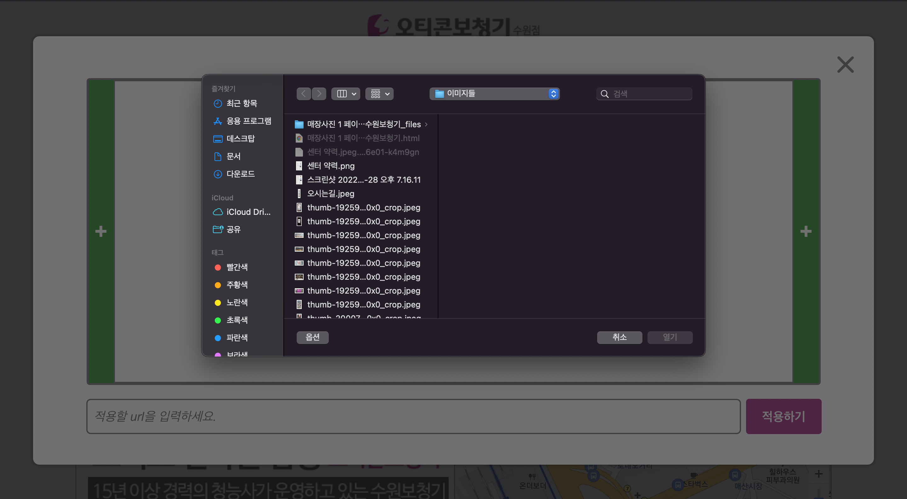

# 🦻🏻hearing_homepage.README

# 🔍 기획배경

- 현재 부모님이 운영하시는 보청기 사무실의 홈페이지 유지비용이 연간 약 45만원이 듭니다. 하
  지만 직접 홈페이지를 제작하여 운영하게 된다면 서버비용과 도메인 비용만 부담하면 되므로비
  교적 적은 비용으로 운영할 수 있습니다.
  - 예상 요금: 연간 약 $46(+a)
    - AWS t4g.micro 3년 예약 인스턴스: $103
    - .com으로 끝나는 도메인: 연간 $12
    - 데이텉 송수신에 따른 네트워크 추가 비용: +a
- 기존의 홈페이지에 이미지를 올리거나 수정을 할 때 업체에게 추가 요금을 지불해야 하는 것과
  의사소통의 번거러움이 있었습니다.
- 홈페이지의 URL이 한국어였으면 좋겠다는 부모님의 희망사항이 있었습니다.
- 프론트엔드 개발자를 목표로 좋은 경험과 공부가 될 수 있을 것 같았습니다.

# 📝 결과

- [수원덴마크오티콘.com](http://수원덴마크오티콘.com) 으로 도메인을 정하여 배포하였습니다.
- 관리자 아이디로 이미지 추가 및 삭제를 통하여 직접 홈페이지를 수정할 수 있도록 만들었습니
  다.
- 홈페이지 도메인은 ‘한국어→퓨니코드’로 변환하여 등록할 예정이며 홈페이지 route path는
  encodeURIComponent를 통하여 적용하였습니다.
- KakaoMap API 적용과 Carousel, ImageList를 구현하면서 많은 공부가 되었습니다.

# 🚧 업데이트 예정

- 보청기 정보를 카드형 리스트로 나열할 수 있는 컴포넌트 구현
- 보청기 타입과 제조사별로 필터링하여 확인할 수 있는 기능
- 반응형 웹

## 👨‍🦳 사용자 View

- 메인 페이지  

  - TopNavBar 메뉴에 마우스 오버한 모습
     

  - 빠른 길찾기 버튼과 지도
     

    - 빠른 길찾기 버튼을 눌렀을 때 kakaomap 빠른 길찾기 페이지가 오픈됩니다.
       

    - 지도에 있는 사무실 위치의 marker를 눌렀을 때 kakaomap의 사무실 정보 페이지가 오픈됩
      니다.
       

- 상세 페이지(수직으로 나열된 이미지 타입)

   

- 상세 페이지(ImageList를 포함한 타입)
   

  - 이미지 클릭시 확대 모달창
     

- 준비중인 페이지(페이지에 업로드한 이미지가 0개일 때)
   

## 🧑‍💻 관리자 View

- 관리자 로그인 페이지: 로그인 정보는 쿠키에 저장됩니다.
   

- 메인 페이지: Carousel의 설정 버튼 이외에 사용자 view와 동일합니다.
   

- 메인 페이지 Carousel 설정 모달창

  - Carousel 이미지에 url 적용: Carousel 아래에 있는 input에 url을 입력하고 ‘적용하기’ 버
    튼을 누르면 Carousel의 현재 이미지에 오픈할 url를 저장할 수 있습니다. 이후에는 메인페
    이지에서 적용한 Carousel의 이미지를 클릭했을 시 저장된 url 페이지가 오픈됩니다.
     

  - Carousel 이미지 삭제: 삭제할 이미지에 마우스 오버하면 삭제버튼을 확인할 수 있습니다.
     

  - Carousel 이미지 추가: Carousel의 왼쪽 추가 버튼을 누르면 현재 페이지 바로 전 위치에 이
    미지를 추가할 수 있고 오른쪽 추가 버튼을 누르면 바로 다음 위치에 이미지를 추가할 수 있
    습니다.
     

- 상세 페이지(수직으로 나열된 이미지 타입)

   

- 수정 버튼 클릭: 수정 버튼을 누르면 이미지 추가 버튼을 확인할 수 있고 이미지 삭제 버튼과
  이미지 추가 버튼을 확인할 수 있습니다. 이미지 추가 버튼은 각 이미지의 상단과 하단에위치
  하며 해당 위치의 버튼을 눌러 이미지를 추가하면 그 위치에 이미지를 추가할 수 있습니다.
   

- 이미지1 아래의 이미지 추가 버튼을 통해 이미지를 추가한 모습
   

- 상세 페이지(ImageList를 포함한 타입)
   

  - 수정 버튼: 수정 버튼을 누르면 이미지 추가 버튼과 각 이미지마다 삭제 버튼을 확인할 수있
    습니다. 이미지 추가를 하면 ImageList의 첫번째 index에 추가됩니다.
     

